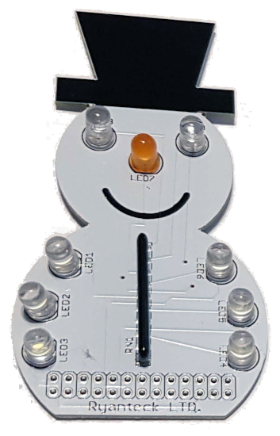

# snowman
Raspberry Pi Snowman Badge based around SnowPi controlled by Pygame Zero with Wireless controller and GPIZero.

The game can be used with qjoypad so that it can be controlled using a games controller.

For more details see: http://www.penguintutor.com/projects/snowman-wearable

You can also see my video below:

## Install

To install extract the files into a directory /home/pi/snowman

To use qjoypad then you should first install qjoypad and then copy the file otherfiles/snowman.lyt to the /home/pi/.qjoypad3 directory.

If you would like the program to start automatically then copy the file otherfiles/snowman.desktop to the directory /home/pi/.config/autostart

## Bugs

If the qjoypad icon does not appear when launching the program using the autostart desktop file then you can add a delay in the snowman.sh file.

Prior to launching qjoypad add the following entry
sleep 5